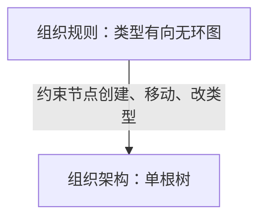

# P1 施工手册

> 修订基线：`main@929bee7`，2026-08-02。  
> 本文件替代此前的 `docs/p1-tutorial.md`。会话 1、会话 2 以仓库实际落地结果为准，不重复施工；会话 3 以后按本文执行。  
> 文档职责：`docs/PLAN.md` 管项目总纲与长期决策；本文管 P1 逐会话施工；`docs/notes/p1-migration-audit.md` 管旧代码处置台账；`STATUS.md` 管真实进度和验收输出。

---

## 0. 总览

### 0.1 P1 目标

P1 在 P0 插件装配、数据库、HTTP、oRPC、前端 manifest 和热插拔基座之上，建立可供 P2–P4 业务直接复用的身份与权限基座：

```text
默认租户解析
  → 本地账号登录
  → Cookie Session
  → 可信 principal
  → 用户唯一归属与唯一用户类型
  → 租户级基础权限
  → 组织节点角色授予
  → self / subtree 作用域授权
  → API 强制鉴权
  → manifest 按权限过滤
```

P1 完成时必须证明：

- 本地账号可以登录、获取当前用户并退出；
- 禁用或过期租户不能登录，已有 Session 也失效；
- 每个用户有且只有一个用户类型和一个主要组织归属；
- 用户类型可以提供与组织范围无关的租户级基础能力；
- 角色可以绑定到组织节点，并按 `self` / `subtree` 生效；
- 角色授予可以限制允许的用户类型和组织类型；
- 无权限用户直接调用 API 得到 403，不能只靠隐藏菜单；
- 不同用户得到不同的页面 manifest；
- 两个租户的数据与授权关系不能串联；
- 全部迁移可以从空 PostgreSQL 18 数据库顺序重放；
- seed 可重复执行，且不会覆盖正常业务修改或静默重置密码。

P1 不是旧 Qualy 的整体搬迁，也不是完整企业 IAM。判断标准仍然是：

> 对 P2–P4 主业务已经存在明确消费者的能力进入 P1；只服务“以后也许需要”的能力暂缓。

---

## 0.2 本次修订原因

旧版教程曾裁决“不迁 `user_types`，学生、审核员、管理员统一用角色表达”。该假设与确认后的业务模型不符。

在新的 Qualy 中，以下三个概念必须分开：

1. **用户归属**：用户在哪里；
2. **用户类型**：用户是什么类别、具备哪些与组织范围无关的基础能力；
3. **角色授予**：用户在某个组织范围内承担什么管理职责。

例如：

```text
用户：张三
主要归属：软件学院 / 2023 级 / 计算机科学与技术 / 软件 2023 级 1 班
用户类型：student
角色授予：
  class-monitor @ 软件 2023 级 1 班 / self
```

“学生”是稳定身份类别，不是频繁变化的职务；“班长”是组织节点上的职务，不是用户类型。将两者统一塞入角色会导致：

- 学生身份必须虚构一个组织作用域；
- 登录方式在认证前无法自然判断；
- 一个角色是否允许授予，又要依赖另一个“身份角色”；
- 用户唯一身份与多角色生命周期混在一起；
- 用户导入、筛选、统计缺少稳定分类字段。

因此，本次修订恢复 `user_types` 这一领域概念，但不照搬旧项目实现。

---

## 0.3 从 qualy_old 选择性保留的内容

### 保留并重构

- 共享表 + `tenant_id` 的多租户数据模型；
- 组织类型、组织规则、组织节点三层概念；
- 组织规则是图，实际组织架构是一棵有根树；
- 用户只有一个主要组织归属；
- 用户只有一个用户类型；
- 一个用户可以拥有多个角色授予；
- 角色授予绑定组织节点，并具有 `self` / `subtree` 范围；
- 角色可以限制允许授予的用户类型和组织类型；
- 本地身份与外部统一认证身份使用 provider / identity 模型；
- Argon2id 密码哈希；
- errors / repo / service / router 的领域分层；
- `ltree` 子树查询和移动算法；
- 系统至少保留一个租户管理员。

### 明确不照搬

- `user_types.capabilities text[]`：改为规范化的 `user_type_permissions`；
- `user_types.is_super_admin`：删除，不采用分散的超级管理员绕过；
- `roles.permissions text[]`：改为 `role_permissions`；
- 缺少 `tenant_id` 的关联表和弱外键：全部改为租户复合外键；
- repo 中接收但不使用 `_tenantId` 的做法：禁止；
- `employee_no` 命名：改为更通用的 `business_no`；
- 旧 NestJS、Hono、Kysely、全局 `db` 和旧 oRPC v1 代码；
- 旧前端 dashboard；
- 旧 capability / CASL / Guard 体系；
- 全量软删除；
- `isSuperAdmin` 或角色名硬编码授权；
- 旧项目的 `org_type_user_types` 用户类型—归属类型矩阵。

最后一项暂不进入 P1。当前已确认的业务需求要求“用户有唯一归属”和“角色限制适用的用户类型、组织类型”，但尚未确认“某用户类型只能归属某些组织类型”是必须规则。若 P2 用户导入真实出现该需求，再增加用户类型归属约束，不提前恢复旧表。

---

## 0.4 核心领域模型

### 0.4.1 租户

租户是所有业务数据的最高隔离边界。

P1 采用：

```text
数据库层：多租户
产品交互层：默认单租户
```

保留：

- `tenants` 表；
- 所有租户业务表的 `tenant_id`；
- 复合外键和租户范围唯一约束；
- Session 中可信的 `tenantId`；
- repository 显式租户过滤；
- 第二租户隔离测试。

P1 不实现：

- 泛域名或 Host 租户解析；
- 用户选择、切换租户；
- 租户 CRUD 页面；
- 平台级超级管理员；
- schema-per-tenant；
- PostgreSQL RLS；
- 跨租户统计；
- 套餐、计费、用户配额。

正常 API input 中禁止提供可自由填写的 `tenantId`。

租户来源只有：

1. 匿名登录阶段：auth 配置中的 `defaultTenantSlug`；
2. 已登录阶段：验证通过的 Session。

未来增加泛域名时，只替换匿名阶段的 tenant resolver，不改变表结构、Session 或 repository 纪律。

### 0.4.2 组织规则与组织架构

组织类型示例：

```text
university
campus
college
grade
department
major
specialization
class
```

组织规则由允许的类型父子边组成，例如：

```text
university → campus
campus     → college
college    → grade
college    → department
grade      → major
major      → specialization
major      → class
specialization → class
```

组织规则是租户级有向图；实际组织节点必须构成一棵有根树：

- 每个租户有且只有一个根节点；
- 根节点没有父节点；
- 其他节点有且只有一个父节点；
- 节点的父类型 → 子类型必须存在于组织规则；
- 组织规则不得形成有向环；
- 一个班级即使允许挂在专业或专业方向下，实际实例中仍只能选择一个父节点。



### 0.4.3 用户归属

每个用户在 P1 有且只有一个主要组织归属：

```text
users.primary_org_node_id
```

它回答：

> 这个用户属于哪里？

用户管理列表、学院/专业/班级推断、组织范围授权目标均围绕该字段展开。

P1 不实现一个用户多个归属。教师兼学生等低频情况暂按多个账号处理；未来如果真实出现跨身份需求，再评估“自然人—账号—身份”三层模型，而不是现在建立多归属表。

### 0.4.4 用户类型

每个用户有且只有一个用户类型：

```text
users.user_type_id
```

它回答：

> 这个用户是什么稳定业务类别？

示例：

```text
administrator
student
faculty
temporary
```

用户类型只负责：

- 是否启用；
- 是否允许本地密码登录；
- 是否允许统一认证登录；
- 与组织范围无关的租户级基础权限；
- 角色授予资格；
- 用户导入、筛选、统计和界面展示。

用户类型不负责：

- 某学院、专业或班级的管理范围；
- 班长、辅导员、教研室主任等职务；
- 组织子树授权；
- 超级管理员绕过。

### 0.4.5 角色与角色授予

角色是职务权限模板；角色授予是用户、角色、组织节点和作用范围之间的关系。

```text
user_role_assignments
  user
  role
  org node
  scope: self | subtree
```

它回答：

> 这个用户在什么组织范围内承担什么管理职责？

示例：

```text
class-monitor @ class-1 / self
counselor     @ software-college / subtree
tenant-admin  @ tenant-root / subtree
```

P1 角色分两类：

- `tenant`：系统级租户角色。P1 只提供系统角色 `tenant-admin`，必须绑定租户根节点；
- `org`：普通组织角色，只能包含组织范围权限，并必须配置允许的用户类型和组织类型。

P1 不开放自定义 tenant 角色，避免普通角色意外携带全租户权限。

### 0.4.6 权限合成

权限分为两种作用域：

- `tenant`：与具体组织节点无关；
- `org`：必须结合目标组织节点判断。

用户类型只能获得 `tenant` 权限。

组织角色只能获得 `org` 权限。

系统 `tenant-admin` 角色可以获得全部权限，并通过根节点 `subtree` 覆盖整棵组织树。

最终判断：

```text
租户级操作允许
  = 用户类型租户权限
  ∪ tenant-admin 角色中的租户权限

组织资源操作允许
  = 某有效角色拥有该组织权限
  且目标节点落在 assignment 的 self/subtree 范围内
```

不实现显式 deny。多个允许来源取并集。

---

## 0.5 会话地图

| 会话 | 状态   | 主题                                          |     预计 |
| ---- | ------ | --------------------------------------------- | -------: |
| 1    | 已完成 | 基座插件骨架与请求上下文                      |        — |
| 2    | 已完成 | 租户与组织树 Schema、迁移、初始 seed          |        — |
| 3    | 下一步 | 用户类型、本地认证、Session 与 bootstrap 修订 | 1.5–2 天 |
| 4    | 计划   | RBAC、用户类型权限与角色资格                  | 1.5–2 天 |
| 5    | 计划   | 组织树 service / API / UI                     | 1–1.5 天 |
| 6    | 计划   | 用户、用户类型、身份和角色管理闭环            | 1.5–2 天 |
| 7    | 计划   | Manifest 权限过滤与 dict 插件                 | 0.5–1 天 |
| 8    | 计划   | 集成验收、隔离测试和文档收口                  |     1 天 |

本次领域修订后，P1 合理总量约为 10–13 个有效开发日。不得为了维持旧版“1–2 周”口号删除已确认的核心领域约束。

发生工期压力时按以下顺序砍单：

1. 砍角色、用户类型和字典的管理 UI，保留 Schema、service、API 和 seed；
2. 砍组织类型/规则管理 UI，保留 API；
3. 砍普通用户创建 UI，保留 API 和测试；
4. 砍 dict 管理 UI，必要时整个 dict 推迟到 P2 前；
5. 不得砍用户类型、Session 安全、租户复合外键、角色适用约束、API 鉴权和双租户测试。

---

## 0.6 插件与 Schema 所有权

```text
@qualy/plugin-org
  tenants
  org_types
  org_type_rules
  org_nodes

@qualy/plugin-auth
  user_types
  users
  auth_providers
  user_identities
  sessions

@qualy/plugin-rbac
  permissions
  user_type_permissions
  roles
  role_permissions
  role_allowed_user_types
  role_allowed_org_types
  user_role_assignments

@qualy/plugin-dict
  dicts
  dict_items
```

Schema 所有权以插件为边界，不建立全仓中央业务 Schema。

插件内部采用按表拆分：

```text
src/db/
  schema.ts
  relations.ts
  tables/
    ...
```

规则：

- `schema.ts` 只做表、枚举、视图的具名再导出；
- 禁止 `export *`；
- helper、常量、custom type、relations 不得从 Schema entry 泄出；
- `schema.ts` 同时服务 Drizzle Kit 聚合和其他插件的 `./schema` import；
- 纯模块拆分不得产生新迁移；
- relations 与 Schema entry 分离；
- `defineRelations()` 在模块顶层只创建一次；
- `ctx.db.withRelations(relations)` 只用于确实消费 `db.query.*` 的查询；
- 普通 SQL-like 查询继续使用 `ctx.db.drizzle`；
- 不建立全局 Relations Registry 或全系统关系大图。

推荐 auth 目录：

```text
packages/plugins/base/auth/src/
  index.ts
  contract.ts
  errors.ts
  repo.ts
  service.ts
  router.ts
  db/
    schema.ts
    relations.ts
    tables/
      user-types.ts
      users.ts
      auth-providers.ts
      user-identities.ts
      sessions.ts
  client/
    index.ts
    LoginPage.tsx
```

推荐 rbac 目录：

```text
packages/plugins/base/rbac/src/
  index.ts
  contract.ts
  errors.ts
  repo.ts
  service.ts
  router.ts
  db/
    schema.ts
    relations.ts
    enums.ts
    tables/
      permissions.ts
      user-type-permissions.ts
      roles.ts
      role-permissions.ts
      role-allowed-user-types.ts
      role-allowed-org-types.ts
      user-role-assignments.ts
```

运行时服务依赖：

```text
database
  ├─ auth
  ├─ rbac
  ├─ org
  └─ dict

server
  ├─ auth
  ├─ rbac
  ├─ org
  └─ dict

ui-registry
  ├─ auth
  ├─ rbac
  ├─ org
  └─ dict
```

关系方向：

- auth 在会话 3 不依赖 rbac；
- rbac 通过静态 `./schema` import 查询 auth 与 org 表，不运行时调用 auth/org service；
- 会话 4 后 auth/org/dict 可 inject rbac 以注册权限或执行鉴权；
- Schema import 是包依赖，不等同于 Cordis Service inject；
- 只有实际调用某 Cordis Service 时才声明 inject。

---

## 0.7 数据模型定案

### 0.7.1 tenants

会话 2 已落地：

```text
tenants
  id uuidv7 PK
  slug varchar(63) UNIQUE
  name varchar(255)
  logo_url nullable
  created_at
  updated_at
```

会话 3 开场增加：

```text
enabled boolean NOT NULL DEFAULT true
expires_at timestamptz NULL
```

语义：

- `enabled=false`：禁止新登录，已有 Session 校验失败；
- `expires_at <= now()`：禁止新登录，已有 Session 校验失败；
- `expires_at IS NULL`：无限期。

P1 不增加：

- `max_users`；
- `created_by`；
- 套餐字段；
- 域名绑定表。

`max_users` 只有用户批量导入或租户配额成为真实需求后再加。`created_by` 会形成 tenant → user 的 bootstrap 反向依赖，暂缓。

### 0.7.2 org_types / org_type_rules / org_nodes

会话 2 已落地四张 org 表、`ltree`、GiST、复合外键、部分唯一索引和引用侧索引。

会话 3 开场补一个数据库不变量：

```text
每租户至多一个 parent_id IS NULL 的 org_nodes 行
```

使用 fix-forward partial unique index：

```text
UNIQUE (tenant_id) WHERE parent_id IS NULL
```

现有 root-name partial unique 不回改历史迁移，可继续保留。

组织 service 在会话 5 负责“至少一个根”和根节点保护；数据库负责“至多一个根”。

组织规则额外要求：

- 同一条边唯一；
- parent type 不能等于 child type；
- 新增边不能使规则图形成环；
- 删除被现有节点父子关系消费的规则时拒绝；
- 删除被节点使用的组织类型时拒绝；
- 更改节点类型必须验证父规则、子规则以及现有角色授予适用性。

### 0.7.3 user_types

```text
user_types
  id uuidv7 PK
  tenant_id uuid NOT NULL
  code varchar(63) NOT NULL
  name varchar(100) NOT NULL
  description varchar(500) NULL
  allow_local_login boolean NOT NULL DEFAULT false
  allow_sso_login boolean NOT NULL DEFAULT false
  enabled boolean NOT NULL DEFAULT true
  is_system boolean NOT NULL DEFAULT false
  sort_order smallint NOT NULL DEFAULT 0
  created_at
  updated_at

  UNIQUE (tenant_id, id)
  UNIQUE (tenant_id, code)
  UNIQUE (tenant_id, name)
```

约束：

- code 使用与现有稳定 code 相同的格式；
- name 非空白；
- sort_order 非负；
- system 类型不可删除、不可改 code；
- 禁用类型后该类型用户的已有 Session 失效；
- P1 每个用户必须且只能引用一个类型。

不增加：

- `capabilities text[]`；
- `is_super_admin`；
- 用户类型—组织类型归属矩阵。

### 0.7.4 users

```text
users
  id uuidv7 PK
  tenant_id uuid NOT NULL
  business_no varchar(64) NULL
  display_name varchar(100) NOT NULL
  user_type_id uuid NOT NULL
  primary_org_node_id uuid NOT NULL
  enabled boolean NOT NULL DEFAULT true
  created_at
  updated_at

  UNIQUE (tenant_id, id)
  UNIQUE (tenant_id, business_no)
    WHERE business_no IS NOT NULL
```

复合外键：

```text
(tenant_id, user_type_id)
  → user_types(tenant_id, id) ON DELETE RESTRICT

(tenant_id, primary_org_node_id)
  → org_nodes(tenant_id, id) ON DELETE RESTRICT
```

索引：

```text
(tenant_id, user_type_id)
(tenant_id, primary_org_node_id, display_name)
```

设计说明：

- `business_no` 承载学号、工号、职工号等租户业务编号；
- bootstrap admin 可以为空；
- P1 不单独在 users 表存 username；
- 登录名属于 `user_identities.identifier`；
- P1 不加 `is_system`，管理员安全由系统角色和 last-admin 规则保证；
- 业务号一旦绑定，普通更新接口不得清空；修改需专门操作并做冲突检查。

### 0.7.5 auth_providers

```text
auth_providers
  id uuidv7 PK
  tenant_id uuid NOT NULL
  code varchar(63) NOT NULL
  type varchar(32) NOT NULL
  name varchar(100) NOT NULL
  config jsonb NOT NULL DEFAULT '{}'
  enabled boolean NOT NULL DEFAULT true
  is_system boolean NOT NULL DEFAULT false
  created_at
  updated_at

  UNIQUE (tenant_id, id)
  UNIQUE (tenant_id, code)
```

P1 只支持：

```text
type = local
```

保留 provider 表是为了未来接入 CAS/OIDC，不在 P1 实现外部回调、SLO、provider UI 或密钥管理。

### 0.7.6 user_identities

```text
user_identities
  id uuidv7 PK
  tenant_id uuid NOT NULL
  user_id uuid NOT NULL
  auth_provider_id uuid NOT NULL
  identifier varchar(255) NOT NULL
  credential_hash text NULL
  bound_at timestamptz NOT NULL
  last_used_at timestamptz NULL

  UNIQUE (tenant_id, id)
  UNIQUE (tenant_id, auth_provider_id, identifier)
  UNIQUE (tenant_id, user_id, auth_provider_id)
```

复合外键：

```text
(tenant_id, user_id)
  → users(tenant_id, id) ON DELETE CASCADE

(tenant_id, auth_provider_id)
  → auth_providers(tenant_id, id) ON DELETE RESTRICT
```

规则：

- local identity 必须有 Argon2id `credential_hash`；
- 外部 provider identity 未来可以没有 credential hash；
- local identifier 在 service 中执行 trim、格式校验和规范化；
- P1 采用不区分大小写的 ASCII 登录名策略，存储规范化后的值；
- 密码和原始凭据不得进入日志、错误详情、STATUS 或 migration。

### 0.7.7 sessions

```text
sessions
  id uuidv7 PK
  tenant_id uuid NOT NULL
  user_id uuid NOT NULL
  token_hash char(64) NOT NULL
  expires_at timestamptz NOT NULL
  last_used_at timestamptz NULL
  login_ip inet NULL
  user_agent text NULL
  created_at timestamptz NOT NULL

  UNIQUE (token_hash)
```

复合外键：

```text
(tenant_id, user_id)
  → users(tenant_id, id) ON DELETE CASCADE
```

索引：

```text
(tenant_id, user_id, expires_at)
```

安全规则：

- 原始 token 使用 32 字节 CSPRNG；
- Cookie 中使用 base64url raw token；
- 数据库只存 `sha256(rawToken)` 的 64 位十六进制值；
- 登录每次创建新 Session，不复用旧 token；
- Cookie：`HttpOnly`、`SameSite=Lax`、`Path=/`；
- production 自动设置 `Secure`；
- Cookie 生命周期与 Session TTL 对齐；
- logout 删除数据库行并清 Cookie；
- `last_used_at` 超过 15 分钟才更新；
- Session 校验同时检查 tenant、user、user type 是否有效；
- 用户、用户类型或租户禁用后，已有 Session 立即失效；
- Session 过期返回认证错误并清理当前 Session 行；
- P1 不实现 Session 管理页面、设备列表和 refresh token。

### 0.7.8 permissions

```text
permissions
  id uuidv7 PK
  code varchar(127) UNIQUE NOT NULL
  plugin varchar(127) NOT NULL
  name varchar(100) NOT NULL
  description varchar(500) NULL
  group_key varchar(63) NULL
  scope varchar(16) NOT NULL       # tenant | org
  grant_to_user_type boolean NOT NULL
  grant_to_role boolean NOT NULL
  default_tenant_admin boolean NOT NULL
  enabled boolean NOT NULL
  created_at
  updated_at
```

权限定义规则：

- code 是稳定 API；
- 已发布 code 不改语义，语义变化创建新 code；
- `grant_to_user_type=true` 时必须 `scope=tenant`；
- org scope 权限不得授予用户类型；
- 普通 org 角色只能包含 org scope 权限；
- 权限是否当前可用还取决于对应插件定义是否处于 active registry；
- 插件停用时数据库行保留，但授权 fail closed。

### 0.7.9 user_type_permissions

```text
user_type_permissions
  tenant_id uuid NOT NULL
  user_type_id uuid NOT NULL
  permission_id uuid NOT NULL
  created_at

  PK (tenant_id, user_type_id, permission_id)
```

复合外键确保用户类型属于同一租户。写入前 service 必须验证：

- permission active；
- permission enabled；
- `grant_to_user_type=true`；
- `scope=tenant`。

### 0.7.10 roles

```text
roles
  id uuidv7 PK
  tenant_id uuid NOT NULL
  code varchar(63) NOT NULL
  name varchar(100) NOT NULL
  description varchar(500) NULL
  kind varchar(16) NOT NULL          # tenant | org
  is_system boolean NOT NULL
  assignable boolean NOT NULL
  enabled boolean NOT NULL
  created_at
  updated_at

  UNIQUE (tenant_id, id)
  UNIQUE (tenant_id, code)
  UNIQUE (tenant_id, name)
```

P1 规则：

- 系统创建 `tenant-admin`，`kind=tenant`；
- 普通角色创建接口只允许 `kind=org`；
- system role 不可删除、不可改 code/kind；
- org role 只能包含 org scope 权限；
- tenant-admin 通过真实 role_permissions 获得权限，不使用 bypass；
- disabled role 不参与授权。

### 0.7.11 role_permissions

```text
role_permissions
  tenant_id uuid NOT NULL
  role_id uuid NOT NULL
  permission_id uuid NOT NULL
  created_at

  PK (tenant_id, role_id, permission_id)
```

写入前验证：

- permission active、enabled；
- `grant_to_role=true`；
- org role 只能绑定 org scope permission；
- system tenant-admin 的权限由 permission registration / bootstrap 追加，不通过普通角色编辑接口删除。

### 0.7.12 role_allowed_user_types

```text
role_allowed_user_types
  tenant_id uuid NOT NULL
  role_id uuid NOT NULL
  user_type_id uuid NOT NULL
  created_at

  PK (tenant_id, role_id, user_type_id)
```

### 0.7.13 role_allowed_org_types

```text
role_allowed_org_types
  tenant_id uuid NOT NULL
  role_id uuid NOT NULL
  org_type_id uuid NOT NULL
  created_at

  PK (tenant_id, role_id, org_type_id)
```

适用约束语义：

- 普通 org 角色必须至少配置一个允许用户类型；
- 普通 org 角色必须至少配置一个允许组织类型；
- 没有允许记录不是“不限制”，而是“不可授予”；
- tenant-admin 不使用这两张表，只能授予到租户根节点；
- 更新允许集合时，如果会使现有 assignment 失效，则拒绝，除非同一事务先同步移除冲突 assignment。

### 0.7.14 user_role_assignments

```text
user_role_assignments
  id uuidv7 PK
  tenant_id uuid NOT NULL
  user_id uuid NOT NULL
  role_id uuid NOT NULL
  org_node_id uuid NOT NULL
  scope varchar(16) NOT NULL       # self | subtree
  created_at

  UNIQUE (tenant_id, user_id, role_id, org_node_id, scope)
```

全部使用租户复合外键：

```text
(tenant_id, user_id)     → users(tenant_id, id)
(tenant_id, role_id)     → roles(tenant_id, id)
(tenant_id, org_node_id) → org_nodes(tenant_id, id)
```

创建 assignment 时必须验证：

- user、role、org node 同租户；
- user 与 role 均 enabled；
- user type 在 role 允许集合中；
- org node type 在 role 允许集合中；
- org role 只能获得 org scope permission；
- tenant-admin 只能挂根节点，scope 固定为 subtree；
- 普通 org role 的 scope 可为 self 或 subtree。

### 0.7.15 dict

保持旧版 P1 的最小模型：

```text
dicts
  id
  tenant_id
  code
  name
  description
  enabled
  created_at
  updated_at

dict_items
  id
  tenant_id
  dict_id
  code
  label
  value jsonb
  sort_order
  enabled
  created_at
  updated_at
```

不支持多语言、层级、版本、生效日期、表达式和导入导出。

---

## 0.8 Drizzle v1 Relations 使用策略

数据库插件已经提供：

```text
ctx.db.drizzle
ctx.db.withRelations(relations)
```

P1 不建立全局关系图。每个消费方只定义自己需要的关系视图。

会话 3 在实现 `validateSession` 和 `getCurrentUser` 前建立 `authRelations`，至少覆盖：

```text
users
  → tenant
  → userType
  → primaryOrgNode

userIdentities
  → user
  → authProvider

sessions
  → user
```

要求：

- 使用当前锁定的 Drizzle `1.0.0-rc.4` 做导出和类型探针；
- 复合租户关系使用多列 from/to；
- relations 常量在模块顶层创建；
- 测试至少执行一次 `db.query.*` 跨插件嵌套查询；
- Schema entry 不导出 relations；
- repository 不因使用 relations 而省略 tenant 条件；
- `ltree` 子树、批量移动和复杂授权 SQL 继续使用 SQL-like builder，不强行改写成 RQB。

---

## 0.9 Seed 与租户初始化定案

当前 `seedCore` 将 tenant、org types、rules 当作严格收敛的系统数据。进入会话 3 后必须进一步修订，因为：

- tenant name/logo 是业务可编辑数据；
- org type name/sort 是业务可编辑数据；
- 组织规则由租户管理员维护；
- 正常业务修改不应导致以后运行 seed 失败。

新的逻辑分四层。

### 0.9.1 平台定义

```text
seedPlatformDefinitions
```

严格管理插件拥有的稳定语义：

- permission code、scope、grant channel；
- 系统角色 code/kind；
- local provider code/type；
- system user type code/isSystem。

稳定语义漂移直接失败；展示名称和描述允许更新或保留业务值，必须明确字段所有权。

### 0.9.2 默认租户 provision

```text
provisionDefaultTenant
```

只在记录不存在时创建：

- default tenant；
- 默认组织类型和规则模板；
- 唯一根节点；
- administrator 用户类型；
- local provider；
- admin 用户和本地 identity；
- tenant-admin assignment。

tenant 已存在时，不把 tenant name、组织类型名称、规则和根节点业务字段强制改回 seed 值。

### 0.9.3 Demo 数据

```text
seedDemoData
```

只有显式：

```bash
QUALY_SEED_DEMO=1 pnpm seed
```

才创建：

- college / major / class 示例后代；
- student / faculty 示例用户类型；
- manager / student 示例账号；
- org-manager 等示例角色。

普通 `pnpm seed` 不向生产式空租户写入“软件学院”“计算机科学与技术”等演示数据。

### 0.9.4 管理员密码

首次创建 admin local identity：

- 必须提供 `QUALY_ADMIN_PASSWORD`；
- 用户名默认 `admin`，可由 `QUALY_ADMIN_USERNAME` 修改；
- 密码按 Argon2id 存储。

管理员 identity 已存在：

- 默认忽略 `QUALY_ADMIN_PASSWORD`，不静默重置；
- 只有 `QUALY_RESET_ADMIN_PASSWORD=1` 时执行重置；
- 重置时仍必须提供 `QUALY_ADMIN_PASSWORD`；
- 日志只输出“created / unchanged / reset”，不得输出凭据；
- 整个 bootstrap 在单事务内执行。

---

## 0.10 请求上下文与认证流程

server 已落地：

```ts
interface AuthPrincipal {
  tenantId: string
  userId: string
  sessionId: string
}

interface ApiContext {
  cordis: Context
  request: IncomingMessage
  response: ServerResponse
  principal?: AuthPrincipal
}
```

auth 插件注册：

```text
server.enrich('auth', resolver)
```

请求流程：

```text
node:http
  → 构造 ApiContext
  → context enrichers 串行执行
  → auth 读取 Cookie
  → hash raw token
  → validate Session + tenant + user + user type
  → 写入 principal
  → oRPC handler
  → procedure 调用 rbac.require / requireAt
```

匿名请求不在 enricher 阶段报错。只有 protected procedure 才返回 `AUTH_REQUIRED`。

客户端可见错误必须在 contract/base builder 中显式声明，不能依赖 oRPC middleware 自动推导：

```text
AUTH_REQUIRED
INVALID_CREDENTIALS
SESSION_EXPIRED
FORBIDDEN
```

错误边界：

- 未认证或 Session 无效：401；
- 已认证但无权限：403；
- 登录失败统一 `INVALID_CREDENTIALS`，不暴露用户名、租户、用户类型或 provider 是否存在；
- 内部日志可以记录错误类别和 request id，但不得记录密码、Cookie 或 raw token。

---

## 0.11 授权 API 定案

```ts
interface PermissionDefinition {
  code: string
  name: string
  description?: string
  groupKey?: string
  scope: 'tenant' | 'org'
  grantToUserType: boolean
  grantToRole: boolean
  defaultTenantAdmin: boolean
}
```

Rbac Service 至少提供：

```ts
definePermissions(
  plugin: string,
  definitions: PermissionDefinition[],
): Disposable

getProfile(
  principal: AuthPrincipal,
): Promise<AccessProfile>

hasPermission(
  principal: AuthPrincipal,
  code: string,
): Promise<boolean>

require(
  principal: AuthPrincipal | undefined,
  code: string,
): Promise<void>

canAt(
  principal: AuthPrincipal,
  code: string,
  targetOrgNodeId: string,
): Promise<boolean>

requireAt(
  principal: AuthPrincipal | undefined,
  code: string,
  targetOrgNodeId: string,
): Promise<void>
```

语义：

- `hasPermission`：用于 manifest，只判断用户是否在任意合法来源拥有该 code；
- `require`：只接受 tenant scope permission；
- `canAt` / `requireAt`：只接受 org scope permission，并检查目标节点；
- 错用 scope 视为程序错误，不能静默降级；
- 不允许业务代码判断 role code/name；
- tenant-admin 也通过真实 role/permission 数据计算，不做 bypass。

`definePermissions` 必须：

- effect-managed；
- 同 code 定义冲突时失败；
- upsert 数据库 reference row；
- 稳定语义字段变化时失败；
- 展示字段可以更新；
- active definition 随插件卸载移除；
- 数据库权限行和 role mapping 不因插件停用而删除；
- `defaultTenantAdmin=true` 时，为每个租户的 tenant-admin 角色幂等补充 mapping；
- 插件未 active 时授权 fail closed。

P1 权限目录建议：

| Code                     | Scope  | User type | Role |
| ------------------------ | ------ | --------- | ---- |
| `auth.portal.access`     | tenant | 是        | 是   |
| `auth.user-type.read`    | tenant | 否        | 是   |
| `auth.user-type.manage`  | tenant | 否        | 是   |
| `auth.user.read`         | org    | 否        | 是   |
| `auth.user.manage`       | org    | 否        | 是   |
| `org.tree.read`          | org    | 否        | 是   |
| `org.tree.manage`        | org    | 否        | 是   |
| `rbac.role.read`         | tenant | 否        | 是   |
| `rbac.role.manage`       | tenant | 否        | 是   |
| `rbac.assignment.read`   | org    | 否        | 是   |
| `rbac.assignment.manage` | org    | 否        | 是   |
| `dict.read`              | tenant | 可选      | 是   |
| `dict.manage`            | tenant | 否        | 是   |

---

## 0.12 UI Registry 接入

ui-registry 保持基础设施插件，不 inject rbac。

会话 7 增加 effect-managed 单槽 authorizer：

```ts
type PageAuthorizer = (
  principal: AuthPrincipal | undefined,
  permission: string | undefined,
  isPublic: boolean,
) => boolean | Promise<boolean>
```

manifest 规则：

```text
匿名：
  只返回 public 页面

已登录：
  public 页面始终返回
  非 public 且无 permission 的页面返回
  有 permission 时调用 rbac.hasPermission

无 authorizer：
  public 页面返回
  permission 页面 fail closed
```

登录和退出后必须失效并重新获取：

```text
/auth/me
/api/ui/manifest
```

菜单隐藏不能替代 API 鉴权。

---

# 会话 1 · 基座插件骨架与请求上下文

## 状态

已完成，不重复执行。

## 已落地事实

- 建立 `@qualy/plugin-org`、`auth`、`rbac`、`dict` 四个插件骨架；
- 各插件有稳定 `./schema` 与 `qualy.database.schemaEntry`；
- server 的 `ApiContext` 已包含 request、response、principal；
- `server.enrich(key, fn)` 已实现：
  - Map 多槽；
  - key 冲突失败；
  - API 请求内串行执行；
  - effect disposal；
  - HMR 后无残留；
- `argon2` 和 `cookie` 已登记 pnpm catalog，但尚未安装到 auth 包；
- tenantId 来源纪律已进入仓库规范。

## 保持不变的验收门禁

```bash
pnpm gen
pnpm typecheck
pnpm test
```

---

# 会话 2 · 租户与组织树 Schema

## 状态

已完成，不重写历史迁移。

## 已落地事实

- org 插件拥有：
  - tenants；
  - org_types；
  - org_type_rules；
  - org_nodes；
- 数据库通过 `(tenant_id, id)` 和复合外键阻止跨租户 parent/type；
- sibling/root 名称唯一；
- `ltree` extension 使用 custom migration；
- GiST index 使用 Drizzle 声明式 Schema；
- `(tenant_id, parent_id, sort_order, name)` 和 `(tenant_id, org_type_id)` 索引已存在；
- UUID 使用 PG18 `uuidv7()`；
- 删除语义已用真实 PG18 固化：
  - tenant cascade；
  - 整树单语句删除；
  - 单独删除有子节点父节点或在用类型被 RESTRICT；
- 集成测试在 CI 中必须连接真实 PostgreSQL；
- org Schema 已按表拆分，`schema.ts` 是纯具名导出；
- seed 已初步拆成 core/demo，但其对 tenant/types/rules 的严格收敛语义将在会话 3 按 §0.9 修订。

## 历史迁移纪律

以下已应用迁移禁止修改：

```text
org-ltree
org-base
org-node-type-index
```

会话 3 的 tenant 状态字段、单根索引和 auth 表全部使用新的 fix-forward migration。

---

# 会话 3 · 用户类型、本地认证与 Session

## 目标

建立用户类型、用户、本地身份和 Cookie Session；每个 API 请求得到可信 principal；修正 tenant 初始化和 seed 的领域边界。

## 3.1 开场裁决与文档同步

开始写 Schema 前：

1. 用本文替换旧 `docs/p1-tutorial.md`；
2. 更新 `docs/notes/p1-migration-audit.md`：
   - `user-type.ts` 从 dropped 改为 adapted；
   - `role-user-type.ts` 改为迁移到 `role_allowed_user_types`；
   - `org-type-role.ts` 改为迁移到 `role_allowed_org_types`；
   - `org-type-user-type.ts` 保持 dropped/deferred；
   - 记录 capabilities、isSuperAdmin、permissions array 不迁；
3. 更新 STATUS 的下一会话说明；
4. 确认工作区 clean 后再写代码。

建议提交：

```text
docs(p1): restore user type domain model
```

## 3.2 org 前置补丁

在 org Schema 增加：

```text
tenants.enabled
tenants.expires_at
UNIQUE (org_nodes.tenant_id) WHERE parent_id IS NULL
```

要求：

- 修改当前表定义；
- 生成命名 fix-forward migration；
- 不修改会话 2 迁移；
- 增加 PG18 测试：
  - 同 tenant 第二个 root 得到 23505；
  - 不同 tenant 各自 root 成功；
  - tenant disabled/expired 字段可读写；
- `drizzle-kit generate` 第二次必须 no-op。

建议提交：

```text
feat(org): add tenant access state and root invariant
```

## 3.3 auth Schema

创建五张表：

```text
user_types
users
auth_providers
user_identities
sessions
```

按 §0.7 定义约束、索引、复合外键和 check。

目录从第一天按表拆分。

auth `package.json` 增加真实依赖：

```text
drizzle-orm
argon2
cookie
@qualy/plugin-database
@qualy/plugin-server
@qualy/plugin-ui-registry
@qualy/plugin-org
```

依赖类别按实际运行/类型用途放在 dependencies、peerDependencies 或 devDependencies，禁止依靠根包偶然解析。

安装 argon2 后按仓库纪律执行精确 build approval。

生成命名迁移：

```bash
pnpm exec drizzle-kit generate --name auth-base
pnpm exec tsx scripts/drop-guard.ts --all
```

## 3.4 Auth Relations

建立模块顶层单例 `authRelations`。

先对 rc.4 做最小类型探针，再实现：

- user → tenant；
- user → user type；
- user → primary org node；
- identity → user/provider；
- session → user。

为 `ctx.db.withRelations(authRelations)` 写测试，至少验证：

```text
session
  + user
  + userType
  + tenant
  + primaryOrgNode
```

一次查询可得到 Session 校验所需数据。

## 3.5 Auth Config

Auth Service Config：

```text
defaultTenantSlug: string = default
cookieName: string = qualy_session
sessionTtlSeconds: number = 604800
touchIntervalSeconds: number = 900
secureCookies: auto | true | false = auto
```

规则：

- `auto` 根据生产环境决定 Secure；
- Config 顶层 `.prefault({})`；
- 构造器接收 `z.input`，内部使用解析后的 `z.output`；
- 不在配置中存管理员密码；
- 密码只来自 seed 命令环境变量。

## 3.6 密码与 identifier

实现独立 helper：

```text
normalizeLocalIdentifier
hashPassword
verifyPassword
```

要求：

- Argon2id；
- 参数显式固定并写入 `docs/notes/auth-security.md`；
- 在目标部署机器上进行一次耗时测试，避免过低或不可接受；
- 登录名 trim + lowercase；
- 限制长度和字符集；
- 密码最小长度 12；
- 密码校验失败与用户不存在使用相同外部错误；
- 禁止记录 hash 以外的密码相关数据。

## 3.7 Auth Service

实现：

```text
loginLocal
validateSession
logout
getCurrentUser
setLocalPassword
```

`loginLocal` 顺序：

1. 根据 `defaultTenantSlug` 查 tenant；
2. 检查 tenant enabled / expiresAt；
3. 查 enabled local provider；
4. 规范化 identifier；
5. 查 identity + user + user type；
6. 检查 user enabled；
7. 检查 user type enabled；
8. 检查 `allowLocalLogin`；
9. Argon2id verify；
10. 创建 Session；
11. 设置 Cookie；
12. 更新 identity lastUsedAt。

步骤 2–9 对客户端统一返回 `INVALID_CREDENTIALS`。

`validateSession`：

1. 读取 Cookie；
2. hash raw token；
3. 查询 Session + user + user type + tenant；
4. 检查 Session expiresAt；
5. 检查 tenant enabled / expiresAt；
6. 检查 user enabled；
7. 检查 user type enabled；
8. 超过 touch interval 时更新 lastUsedAt；
9. 返回 principal。

不要求每次 Session 校验重新检查 `allowLocalLogin`；该字段是登录入口策略。禁用 user type、user 或 tenant 才是已有 Session 的即时撤销手段。

`logout`：

- hash 当前 Cookie；
- tenant scoped 删除 Session；
- 无论 Session 是否存在都清 Cookie；
- 幂等返回成功。

## 3.8 Principal Enricher

Auth 插件注册：

```text
ctx.server.enrich('auth', ...)
```

要求：

- 无 Cookie 时不报错；
- 无效或过期 Cookie 时清 Cookie但仍按匿名继续；
- 有效时写 `context.principal`；
- resolver 只在 `/api` 请求执行，沿用 server 现有边界；
- HMR 后无重复注册。

## 3.9 Contract 与 Router

公开 API：

```text
POST /auth/local/login
POST /auth/logout
GET  /auth/me
```

DTO：

```text
/auth/me
  user:
    id
    displayName
    businessNo
    userType:
      id
      code
      name
    primaryOrgNode:
      id
      code
      name
    tenant:
      id
      slug
      name
```

禁止把数据库 row 或 credential/session 字段直接作为 DTO。

错误：

```text
INVALID_CREDENTIALS
AUTH_REQUIRED
SESSION_EXPIRED
```

## 3.10 LoginPage

新增 public 页面：

```text
path: /login
layout: blank
public: true
```

功能只包含：

- identifier；
- password；
- 提交状态；
- 统一错误提示；
- 登录成功后刷新 `/auth/me` 和 manifest；
- 不实现注册、找回密码、记住我、验证码、MFA。

## 3.11 Seed 重构

按 §0.9 重构当前 seed。

本会话必须解决：

- tenant name 不再严格漂移；
- org type name/sort 和规则不再被普通 seed 强制收敛；
- fresh tenant 始终有唯一 root；
- demo 后代只在 `QUALY_SEED_DEMO=1` 时创建；
- 创建 administrator system user type；
- 创建 local provider；
- 创建 admin user，primary org = root；
- 创建 local identity；
- 管理员密码 reset 语义显式；
- 全部在一个事务内。

seed 函数保持无顶层副作用，runner 只负责连接、事务、环境变量和日志。

## 3.12 测试

### Schema / PG18

- user 跨租户引用 user type → 23503；
- user 跨租户引用 org node → 23503；
- identity 跨租户引用 user/provider → 23503；
- 同 provider identifier 冲突 → 23505；
- businessNo 同 tenant 冲突，不同 tenant 可重复；
- 第二 root 同 tenant → 23505；
- UUIDv7；
- auth migration 空库重放。

### Auth

- 正确密码登录；
- 错误密码；
- 不存在用户；
- tenant disabled；
- tenant expired；
- provider disabled；
- user disabled；
- user type disabled；
- user type 不允许 local；
- token 数据库值与 Cookie 不同；
- Session 过期；
- logout 幂等；
- 用户禁用后旧 Session 失效；
- 类型禁用后旧 Session 失效；
- tenant 禁用后旧 Session 失效；
- Cookie flags；
- raw token/密码不进入日志；
- local identifier 大小写规范化。

### Seed

- fresh provision；
- 二次运行零重复；
- tenant/org 展示字段被业务修改后普通 seed 不回写、不失败；
- demo 默认不创建；
- `QUALY_SEED_DEMO=1` 创建且可验证；
- admin 已存在时密码不变；
- reset flag 时密码改变；
- 任一步失败时事务零部分写入。

## 3.13 验收

```bash
pnpm install
pnpm typecheck
pnpm test
pnpm db:reset
QUALY_ADMIN_PASSWORD='<dev-only-password>' pnpm seed
pnpm dev
```

手工：

```bash
curl -i \
  -c /tmp/qualy-cookie \
  -H 'content-type: application/json' \
  -d '{"identifier":"admin","password":"<dev-only-password>"}' \
  http://localhost:3000/api/auth/local/login

curl -i \
  -b /tmp/qualy-cookie \
  http://localhost:3000/api/auth/me

curl -i \
  -b /tmp/qualy-cookie \
  -X POST \
  http://localhost:3000/api/auth/logout
```

完成条件：

- login 有 Set-Cookie；
- `/auth/me` 返回 tenant、user type、primary org；
- Session 表只有 hash；
- logout 后 `/auth/me` 401；
- `drizzle-kit generate` no-op；
- 全部测试绿。

建议提交拆分：

```text
feat(org): add tenant access state and root invariant
feat(auth): add user types and local session schema
feat(auth): implement local login and principal resolver
feat(db): provision default tenant and administrator
feat(web): add local login page
```

---

# 会话 4 · RBAC、用户类型权限与角色资格

## 目标

建立规范化权限目录、用户类型基础权限、组织角色、适用约束和统一授权服务。

## 4.1 Schema

创建：

```text
permissions
user_type_permissions
roles
role_permissions
role_allowed_user_types
role_allowed_org_types
user_role_assignments
```

按 §0.7 定义复合外键、PK、unique 和索引。

需要的查询索引至少包括：

```text
user_type_permissions (tenant_id, user_type_id)
role_permissions      (tenant_id, role_id)
assignments           (tenant_id, user_id)
assignments           (tenant_id, org_node_id)
assignments           (tenant_id, role_id)
```

## 4.2 Rbac Service

将 rbac 插件改为 Cordis Service，暴露 §0.11 API。

不实现：

- CASL；
- deny；
- JSON 条件表达式；
- Redis 权限缓存；
- 跨请求 profile 缓存；
- role name 判断；
- isSuperAdmin bypass。

## 4.3 Permission Registry

每个插件声明自己的 permission definitions。

P1 顺序：

1. rbac 先声明自身权限；
2. auth 增加 rbac inject 后声明 auth 权限；
3. org 在会话 5 声明 org 权限；
4. dict 在会话 7 声明 dict 权限。

冲突规则：

- 同 code、稳定语义一致：允许 HMR 重建；
- scope/grant channel 不一致：硬失败；
- name/description 更新：允许 upsert；
- 插件卸载：内存 active definition 移除；
- DB row 保留；
- 授权对 inactive code fail closed。

## 4.4 Bootstrap

创建系统角色：

```text
tenant-admin
  kind = tenant
  isSystem = true
  assignable = true
  enabled = true
```

管理员 assignment：

```text
admin
  tenant-admin @ root / subtree
```

所有 `defaultTenantAdmin=true` 的 active permissions 幂等加入该角色。

不使用任何管理员 bypass。

至少保护：

- 系统角色不可删除；
- tenant-admin code/kind 不可修改；
- 最后一个有效 tenant-admin assignment 不可移除；
- 最后一个 tenant-admin 用户不可禁用；
- tenant-admin 只能绑定 root/subtree。

## 4.5 用户类型权限

administrator 类型至少获得：

```text
auth.portal.access
```

Demo student/faculty 类型也可获得 portal access。

用户类型权限只用于 tenant scope。

## 4.6 普通组织角色

Demo 可建立：

```text
org-manager
  allowed user types: administrator, faculty
  allowed org types: college, major
  permissions:
    org.tree.read
    org.tree.manage
    auth.user.read
    auth.user.manage
    rbac.assignment.read
    rbac.assignment.manage
```

不要再创建 `STUDENT` 角色；student 是 user type。

## 4.7 授权 SQL

`require`：

- 解析 permission；
- 必须 scope=tenant；
- 检查 user type permission；
- 检查有效 tenant role permission；
- tenant/user/user type/role/permission 全部 enabled；
- permission definition active。

`requireAt`：

- 解析 permission；
- 必须 scope=org；
- 查询目标节点 tenant/path；
- 查询用户有效 assignments；
- assignment `self`：node id 相等；
- assignment `subtree`：target path 位于 assignment path 下；
- tenant-admin root/subtree 与普通 org role 走同一算法；
- 全部 tenant scoped。

## 4.8 角色授予资格

创建 assignment 前验证：

- user/role/node 存在且同 tenant；
- user/role enabled；
- org role 的 allowed user types 包含用户类型；
- allowed org types 包含目标节点类型；
- tenant role 只能 root/subtree；
- assignment unique。

角色允许集合或用户类型变化时：

- 不能留下不合法现有 assignment；
- service 返回明确领域错误；
- sync 接口必须在事务内处理。

## 4.9 测试矩阵

用户：

```text
admin
  type administrator
  tenant-admin @ root/subtree

manager
  type faculty
  org-manager @ software-college/subtree

student
  type student
  no management role
```

验证：

| 操作             | admin | manager | student |
| ---------------- | ----- | ------- | ------- |
| portal access    | 允许  | 允许    | 允许    |
| 管理角色         | 允许  | 拒绝    | 拒绝    |
| 修改授权学院子树 | 允许  | 允许    | 拒绝    |
| 修改其他学院     | 允许  | 拒绝    | 拒绝    |
| 管理授权子树用户 | 允许  | 允许    | 拒绝    |

还必须验证：

- 用户类型权限生效；
- 多角色取并集；
- self 不覆盖子节点；
- subtree 包含自身和后代；
- disabled role 不生效；
- disabled permission 不生效；
- inactive plugin permission 不生效；
- 不允许把 tenant permission 加到 org role；
- 不允许把 org permission 加到 user type；
- 不允许给 faculty 之外用户授予受限角色；
- 不允许把角色挂到未允许组织类型；
- tenant A assignment 不影响 tenant B；
- 401/403 区分；
- 最后 tenant-admin 保护。

## 4.10 验收

```bash
pnpm typecheck
pnpm test
pnpm db:reset
QUALY_ADMIN_PASSWORD='<dev-only-password>' \
QUALY_SEED_DEMO=1 \
pnpm seed
```

建议提交：

```text
feat(rbac): add scoped permission model
feat(rbac): enforce role applicability and subtree access
feat(db): bootstrap tenant administrator permissions
```

---

# 会话 5 · 组织树领域、API 与页面

## 目标

迁移旧组织树的有效领域逻辑，接入当前 Drizzle、oRPC、Cordis、RBAC 和新的单根/规则 DAG 约束。

## 5.1 errors / repo / service

按顺序迁移：

1. errors；
2. tests；
3. repo；
4. service；
5. contract/router/index；
6. client page。

禁止整目录复制。

Repo：

- 显式接收 db/tx；
- 所有查询 tenant scoped；
- 子树移动事务化；
- path/depth 显式维护；
- 不返回多余字段；
- 不把 row 直接作为 DTO。

Service：

- org type CRUD；
- rule CRUD；
- root 查询；
- tree/list；
- node CRUD；
- move subtree。

## 5.2 必须保留或新增的规则

- 单根；
- 根不可移动、不可删除；
- 非根必须有 parent；
- 规则图不得成环；
- 节点 parent/child 类型满足规则；
- 自移动拒绝；
- 移入后代拒绝；
- 移动后整棵子树 path/depth 更新；
- 修改节点类型需验证 parent 和全部 children；
- 修改节点类型需通过 rbac 检查现有 assignments 的 allowed org types；
- 删除非叶子失败；
- 删除有 users 或 assignments 的节点由 FK/领域错误拒绝；
- 删除在用 org type/rule 失败；
- 所有 mutation 事务化。

## 5.3 权限

org 插件声明：

```text
org.tree.read   scope=org
org.tree.manage scope=org
```

路由：

- tree/query：`requireAt(org.tree.read, root or requested node)`；
- create：目标为 parent；
- update/delete/move：目标为被操作节点；
- type/rule 管理：目标为 root；
- tenant-admin 通过 root/subtree 自然获得全树权限。

## 5.4 Contract

DTO 不暴露 ltree 内部字符串作为业务主接口，可返回：

```text
id
code
name
type
parentId
depth
sortOrder
children
```

移动 input：

```text
nodeId
newParentId
newSortOrder?
```

tenantId 不得出现在 input。

## 5.5 OrgPage

最小功能：

- 树展示；
- 选择节点；
- 新建/编辑/删除；
- parent selector 移动；
- 类型和规则基础管理；
- 权限不足时不显示 mutation 控件；
- 不做拖拽、批量导入、复杂可视化图编辑器。

## 5.6 测试

- 合法创建；
- 第二 root；
- 规则图成环；
- 非法类型层级；
- 同父同名；
- 根保护；
- 自移动；
- 移入后代；
- 子树 path/depth；
- 修改类型导致 child 不兼容；
- 修改类型导致角色 assignment 不兼容；
- 删除非叶子；
- 删除有用户节点；
- 越权修改 403；
- 跨租户裸写 23503。

## 5.7 验收

manager：

- 看得到授权学院子树；
- 可修改授权子树；
- 修改其他学院 403；
- 直接调用 API 仍被拒绝；
- 页面、路由随插件停用撤销。

建议提交：

```text
feat(org): add organization domain service
feat(org): expose scoped organization api
feat(web): add organization management page
```

---

# 会话 6 · 用户、用户类型、身份与角色管理

## 目标

建立 P1 最小 IAM 管理闭环，不追求完整后台。

## 6.1 用户类型管理

API：

```text
listUserTypes
getUserType
createUserType
updateUserType
setUserTypeEnabled
syncUserTypePermissions
deleteUserType
```

规则：

- code tenant 内唯一；
- system type code/isSystem 不可改；
- system type 不可删；
- 在用类型不可删；
- 禁用类型使其用户 Session 失效；
- permission 只能从 grant_to_user_type 的 tenant permissions 选择；
- 禁止禁用最后一个有效 tenant-admin 用户所需类型，避免锁死；
- 不实现 user type → allowed org types。

权限：

```text
auth.user-type.read
auth.user-type.manage
```

均为 tenant scope。

## 6.2 用户管理

API：

```text
listUsers
getUser
createUser
updateUser
setUserEnabled
changeBusinessNo
setLocalIdentity
setLocalPassword
```

创建必须：

- tenant 来自 principal；
- user type 同 tenant且 enabled；
- primary org node 同 tenant；
- caller 对目标节点有 `auth.user.manage`；
- businessNo tenant 内唯一；
- local identity 可选；
- 密码有则 Argon2id。

更新：

- 修改 primary org 时，caller 必须同时能管理旧节点与新节点；
- 修改 user type 时，现有 role assignments 必须全部允许新类型；
- businessNo 普通 update 不允许清空；
- 禁用用户前执行 last-admin 保护；
- 用户禁用后 Session 失效。

列表：

- 以 primary org node 为归属；
- `self` 只看目标节点；
- `subtree` 使用 ltree；
- 可推断学院/专业/班级等祖先信息，但不额外冗余存列。

权限：

```text
auth.user.read
auth.user.manage
```

均为 org scope。

## 6.3 角色管理

API：

```text
listRoles
getRole
createOrgRole
updateOrgRole
setRoleEnabled
syncRolePermissions
syncRoleAllowedUserTypes
syncRoleAllowedOrgTypes
deleteRole
```

规则：

- 普通接口只能创建 org role；
- org role 至少一个 allowed user type 和 org type；
- org role 只能绑定 org permissions；
- system role 不可删除或改 code/kind；
- 删除有 assignment 的 role 失败；
- 修改 allowed 集合时不能留下非法 assignment；
- sync 接口在事务内计算差集；
- 重复执行幂等。

## 6.4 Assignment 管理

API：

```text
listAssignmentsByUser
listAssignmentsByNode
syncUserAssignments
revokeAssignment
```

权限：

```text
rbac.assignment.read
rbac.assignment.manage
```

均为 org scope。

调用者需要对 assignment 目标节点具备权限。

tenant-admin：

- 可通过受保护管理接口授予；
- 只能 root/subtree；
- 只有已有 tenant-admin 才可授予/撤销；
- 最后一个有效 assignment 不可撤销。

## 6.5 页面

最小页面：

```text
/admin/users
/admin/user-types
/admin/roles
```

只实现：

- 用户列表、创建和启停；
- 用户类型列表、登录策略和基础权限 checkbox；
- 角色列表、org 权限、允许用户类型和组织类型；
- assignment 编辑；
- 不做批量导入、拖拽、复杂筛选、头像、邮件通知。

## 6.6 跨领域一致性

必须处理：

- 用户类型变化与现有 assignment；
- 角色允许集合变化与现有 assignment；
- org node 类型变化与 assignment；
- org type 删除与 role allowed links；
- org node 删除与 users / assignments；
- 最后 tenant-admin；
- system role/type 保护。

跨插件调用可通过 service 完成，禁止为规避依赖而重复业务规则。

## 6.7 测试

- 创建用户；
- businessNo 唯一；
- 跨租户 user type/org node；
- 用户类型权限同步幂等；
- 修改 user type 导致 assignment 不兼容；
- 角色 allowed 集合同步；
- 角色无允许类型不能授予；
- 删除在用 role/type；
- 最后 admin 保护；
- 用户禁用 Session 失效；
- 越权管理其他子树用户 403；
- tenantId input 不存在。

建议提交：

```text
feat(auth): add user and user type management
feat(rbac): add role and assignment management
feat(web): add identity administration pages
```

---

# 会话 7 · Manifest 权限过滤与 Dict

## 目标

让页面 manifest 真实受登录和权限控制，并用 dict 验证普通业务插件贡献权限的模式。

## 7.1 Authorizer

ui-registry 增单槽 authorizer。

rbac 注册 authorizer，调用 `hasPermission`。

必须 effect-managed，重复注册失败，停用 rbac 后 permission 页面 fail closed。

## 7.2 页面权限

建议：

```text
/login            public
/admin/org        org.tree.read
/admin/users      auth.user.read
/admin/user-types auth.user-type.read
/admin/roles      rbac.role.read
/admin/dicts      dict.read
```

登录/退出后重新请求 manifest。

无权限不仅页面隐藏，API 同样拒绝。

## 7.3 Dict

实现最小 Schema、service、contract/router、页面。

dict 声明：

```text
dict.read
dict.manage
```

二者 tenant scope；是否允许 user type 获取 `dict.read` 由定义决定。

Seed 一个演示字典只在 `QUALY_SEED_DEMO=1` 时执行。

## 7.4 生命周期测试

停用 dict：

- route 404；
- manifest 页面消失；
- DB 表和权限行保留；
- 其他插件正常。

停用 rbac：

- permission 页面不可见；
- protected API 不得降级放行。

恢复/HMR：

- 无重复 authorizer；
- permission definitions 幂等；
- manifest 恢复。

建议提交：

```text
feat(ui): filter manifest by active permissions
feat(dict): add tenant dictionaries
feat(web): add dictionary management page
```

---

# 会话 8 · 集成验收与收口

## 目标

证明 P1 是完整、可信、可迁移的身份权限基座。

## 8.1 类型门禁

```bash
pnpm typecheck
```

覆盖：

- contracts；
- implementations；
- api-client；
- plugin clients；
- tests；
- context augmentation；
- Drizzle relations。

## 8.2 单元测试

- identifier normalization；
- Argon2 helper；
- Session token hash；
- Cookie flags；
- permission definition conflicts；
- user type permission；
- role union；
- self/subtree；
- role applicability；
- last-admin；
- domain error translation。

## 8.3 PG18 集成测试

CI 必须真实 PostgreSQL 18：

- ltree；
- GiST；
- UUIDv7；
- composite FK；
- partial unique root；
- auth tenant isolation；
- RBAC tenant isolation；
- subtree authorization；
- subtree move；
- migration replay；
- seed transaction。

PGlite 只做其明确支持的普通迁移/查询冒烟。

## 8.4 HTTP 测试

- login/me/logout；
- Cookie lifecycle；
- 401/403；
- tenant disabled/expired；
- user/type disabled；
- manifest 差异；
- direct API authorization；
- plugin disable/restore；
- HMR effect cleanup。

## 8.5 最终场景

### 匿名

- 只看到 public 页面；
- protected API 401。

### 租户管理员

- admin 登录；
- 获得 tenant-admin @ root/subtree；
- 可管理组织、用户类型、用户、角色、字典；
- 权限来自真实 role_permissions，不是 bypass。

### 学院管理员

- faculty user type；
- org-manager @ college/subtree；
- 可管理学院子树组织和用户；
- 其他学院 403；
- 无角色管理 tenant 权限。

### 学生

- student user type；
- 只有 portal 基础权限；
- 无管理页面；
- 手工调用管理 API 403。

### 角色资格

- class-monitor 不能授予 faculty（若只允许 student）；
- class-monitor 不能绑定 college（若只允许 class）；
- 合法 student + class 成功。

### 租户隔离

- tenant A user 不能引用 tenant B type/node/provider/role；
- tenant A assignment 不能绑定 tenant B；
- input 不接受 tenantId；
- Session tenant 固定；
- 修改 Header 不能切换。

### 插件生命周期

- dict 停用 route/manifest 双重消失；
- rbac 停用 fail closed；
- auth 停用 principal 不残留；
- 恢复后 effect 无重复。

## 8.6 数据库验收

```bash
pnpm db:reset
QUALY_ADMIN_PASSWORD='<dev-only-password>' \
QUALY_SEED_DEMO=1 \
pnpm seed

pnpm exec drizzle-kit check
pnpm exec drizzle-kit generate
git status --porcelain -- db/migrations
pnpm exec tsx scripts/drop-guard.ts --all
```

要求：

- 空库完整重放；
- no-op generate；
- seed 二跑幂等；
- 业务可编辑字段不被 seed 回写；
- 密码不静默重置；
- 无 `DROP ... CASCADE`；
- 已应用迁移未修改；
- CI PostgreSQL 不可达时失败。

## 8.7 文档收口

更新：

- `docs/PLAN.md`：
  - P1 完成；
  - 用户归属 / 用户类型 / 角色授予三分；
  - 权限 scope 和 grant channel；
- `CLAUDE.md`：
  - tenant、principal、permission、system role/type 纪律；
- `STATUS.md`：
  - 每会话真实输出；
  - 未完成项；
- `docs/notes/p1-migration-audit.md`：
  - migrated / adapted / dropped；
- `docs/notes/auth-security.md`：
  - Argon2；
  - Cookie；
  - Session hash；
  - tenant derivation；
- `docs/notes/rbac.md`：
  - permission scope；
  - user type permissions；
  - role applicability；
  - self/subtree；
  - tenant-admin 无 bypass；
- `docs/reports/P1-REPORT.md`：
  - 验收证据和论文素材。

最终提交：

```text
docs(repo): close identity and access foundation
```

---

## 9. 迁移审计更新模板

`docs/notes/p1-migration-audit.md` 应调整为：

| 旧对象                 | 新落点                       | 裁决                         |
| ---------------------- | ---------------------------- | ---------------------------- |
| tenant                 | org/tenants                  | 迁移并简化                   |
| org type/rule/node     | org                          | 已迁移并加租户复合 FK        |
| user type              | auth/user_types              | 恢复概念、重写字段           |
| user type capabilities | rbac/user_type_permissions   | 规范化                       |
| isSuperAdmin           | —                            | dropped                      |
| user                   | auth/users                   | businessNo + 单类型 + 单归属 |
| auth provider          | auth                         | 迁移，P1 local               |
| identity               | auth                         | 迁移并加固                   |
| session                | auth                         | raw token 改 hash            |
| role permissions array | rbac/role_permissions        | 规范化                       |
| role-user-type         | rbac/role_allowed_user_types | 迁移并加租户 FK              |
| org-type-role          | rbac/role_allowed_org_types  | 迁移并加租户 FK              |
| org-type-user-type     | —                            | deferred                     |
| user-role              | rbac/user_role_assignments   | 迁移并加 tenant/scope        |
| CASL/Guard             | —                            | dropped                      |
| 旧 dashboard           | —                            | dropped                      |

审计状态必须以实际代码为准，不因本教程计划提前标记完成。

---

## 10. P1 工程纪律

1. `tenantId` 只能来自配置、Session 或服务端已验证关联对象。
2. 普通 contract input 禁止可自由填写的 `tenantId`。
3. 每个 tenant-owned repository 查询必须显式 tenant scoped。
4. 跨租户关联使用复合外键，不能依赖 UUID 全局唯一。
5. 用户归属、用户类型、角色授予是三个不同概念。
6. 一个用户 P1 只有一个 user type 和一个 primary org node。
7. 用户类型只能获得 tenant scope permission。
8. 普通 org role 只能获得 org scope permission。
9. 角色授予必须检查 allowed user types 和 allowed org types。
10. 菜单隐藏不能替代 API 鉴权。
11. procedure 使用 permission code，禁止判断 role name。
12. permission code 发布后视为稳定 API。
13. tenant-admin 走真实角色权限，不使用 bypass。
14. 密码、Cookie、raw Session token 禁止进入日志。
15. Session 数据库只存 hash。
16. system role/type 不可通过普通接口删除或改稳定 code。
17. 任何 admin 变更必须经过 last-admin 保护。
18. Schema entry 只导出表、枚举、视图；relations/helper 分离。
19. `defineRelations()` 顶层单例，禁止请求内重复创建。
20. custom SQL 继续走现有 custom migration 通道。
21. 已应用迁移不可回改，只 fix-forward。
22. 测试不得改写仓库跟踪文件。
23. beta/rc API 先探针再写正式代码。
24. 旧代码只迁移领域价值，不迁框架和历史兼容层。
25. 新基础设施机制必须满足数据层 retrospective 的真实触发条件。

---

## 11. P1 明确不做

- Host/泛域名租户解析；
- 在线租户切换；
- 租户管理 UI；
- 平台超级管理员；
- tenant quota / max users / billing；
- schema-per-tenant；
- RLS；
- CAS/OIDC/SAML 实际接入；
- 注册、找回密码、邮件验证；
- MFA；
- Session/设备管理页；
- refresh token；
- 用户批量导入；
- 一个用户多个主要归属；
- 自然人合并多个账号；
- user type → allowed org types；
- 自定义 tenant 角色；
- deny 权限；
- 条件表达式；
- 字段级权限；
- Redis 权限缓存；
- 全表软删除；
- 审计日志平台；
- 角色拖拽排序；
- 组织图可视化编辑器；
- 字典国际化、层级、版本；
- 旧数据库自动导入；
- 完整设计系统和移动端适配。

只有 P2–P4 出现真实阻塞时，才重新评估上述事项。

---

## 12. 开始会话 3 前的最终检查表

- [ ] 本文件已替换旧教程；
- [ ] migration audit 已撤销“不迁 user_types”旧裁决；
- [ ] STATUS 下一会话已更新；
- [ ] 当前 HEAD 包含 org Schema 拆分和 seed core/demo 提交；
- [ ] 工作区 clean；
- [ ] PostgreSQL 18 service 可用；
- [ ] `pnpm typecheck` 绿；
- [ ] `pnpm test` 绿；
- [ ] `drizzle-kit generate` no-op；
- [ ] 先写 tenant 状态 + 单根 fix-forward；
- [ ] 再写 auth 五表；
- [ ] 在 validateSession 前落地 authRelations；
- [ ] Argon2 build approval 精确执行；
- [ ] 管理员密码语义按 §0.9.4 实现；
- [ ] 不再创建 STUDENT 角色；
- [ ] 不引入 isSuperAdmin bypass。
